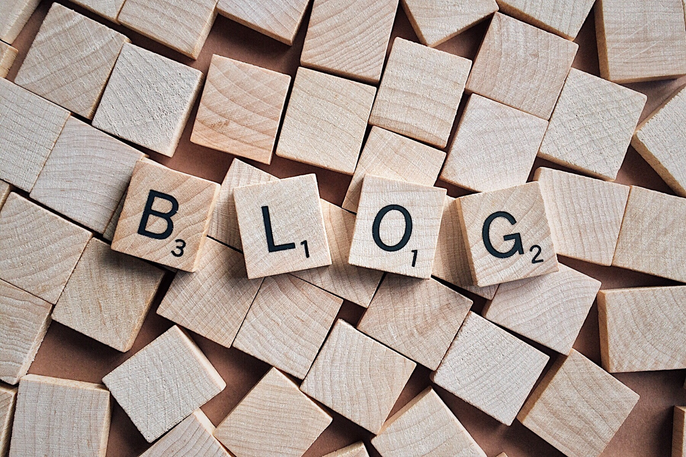

**Fun fact:** A lot of people *blog*. Not really a fun fact. I don't even know if a lot of people do so :) I believe that there are multiple reasons why people actually make blog posts. Perhaps they enjoy the art of writing? Is it a talent? A habit? Something they want to explore more as a hobby?

For whatever reasons other people have in mind on why they blog, I got my personal reasons. And what a better way it is to start my blogging habit than to begin by stating why I want to blog.

Huge, huge catch, though! I've never really *blog* before. It's the start of a journey for me as well.

But back to what's the focus of this post. Here's a couple of reasons why I have decided to start blogging!

### From Small Notes to Blog Posts

I know a lot of people might prefer to use desktop/mobile apps like *OneNote*, *Bear*, or even Apple's own *Notes*. I've tried them all, personally. Not that I hate them. But I found that when you write your notes as a blog post, the things you typed down are more like sentences rather than phrases. Things are more readable like articles rather than tiny notes. Everything becomes something worth sharing rather than worth keeping.

The point is that I'm trying to turn what's rather small, vague, and unrelated into something more profound, inclusive, and well though-out. Blog posts fit my intention. They tie things up into a proper narrative and allow the writer (that's me!) to be able to come back and read through at a later time. Another great thing about doing this is that I can also share my posts with all of you too!

### Mastering the Art of Communicating

Although writing is an art of its own, I believe that those who blog are inherently practicing the perfection of communicating with their audiences as well. Have you ever come across an article on Medium that was written so well you had to look up the author of the post? In one example, I found out that the author was a software engineering intern! He's only 16 (and I'm almost done with university)! He wrote a post that I felt like a senior developer who was writing to an audience full of non-technical users.

That was a true example by the way. And it really did spark my interest in blogging. So remember why blogging might be useful to you. If your readers enjoy the article you wrote, know that you have unlock your ability to communicate well.

### Sharing is Caring

It sounds cliche whenever I hear the phrase "Sharing is Caring" but this phrase now means a lot to me. Blogging means allowing myself to contribute to the world by sharing my knowledge and experiences. By sharing what I know with others, I also get the benefit of mastering my own content, becoming subject-matter expert, and also to gain authority on the topic that I've written about.

Thanks for reading my first blog post! Stay tune for more content.