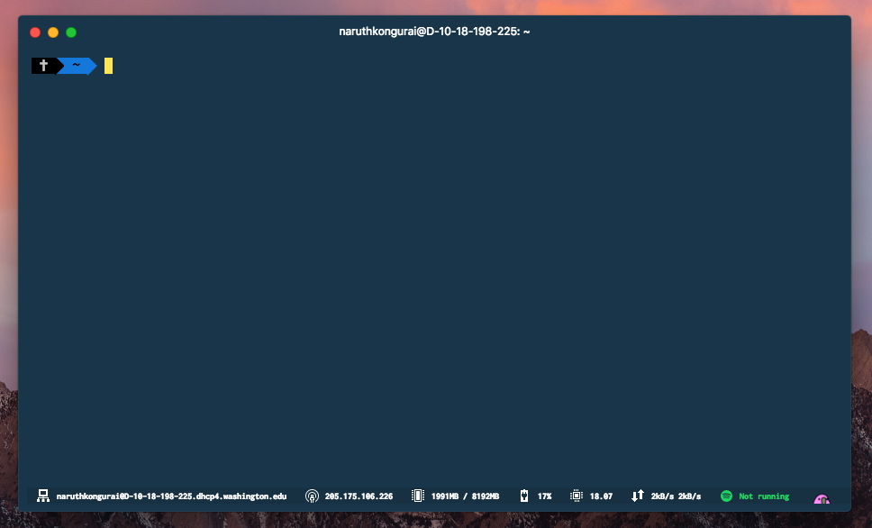

I recently switched to [Hyper](https://hyper.is/), a wonderful, web-based terminal that is built by developers at [Zeit](http://zeit.co).

It has been treating me well so far. My previous terminal was iTerm2 (which was great by the way), but I want to try something new. To experiment, perhaps.


### Built with HTML, CSS, JavaScript

Powering behind Hyper is Electron, an open-source technology built for speed and performance.

### Beautiful, Minimalist in Design



No need to explain this part. But seriously though, Hyper has got to be up there in terms of best design of a terminal.

### Simple & Easy Configurations

Everything you'd want to configure for Hyper is on this single file: `hyper.js`. Treat it like our familiar `package.json` file for Node.

Say you want to add a plugin. Install it via `npm`. Then just do add a value to the array:

```javascript
plugins: [
  'hyperline'
]
```

Hit Save! That's it 🔥

---

### Some Goodies I Recommend

- **[Cobalt2 Theme by Wes Bos](https://github.com/wesbos/hyperterm-cobalt2-theme)**: An awesome dark but modern theme by Wes Bos.
- **[Hyperline](https://github.com/Hyperline/hyperline)**: This provides a mini status bar at the bottom of your Hyper terminal, giving you IP address, CPU usage, and other information!


If you're looking for more, [Tierney Cyren's Awesome Hyper repository](https://github.com/bnb/awesome-hyper) has a growing list of Hyper plugins, extensions, themes, and more 🔥!

---