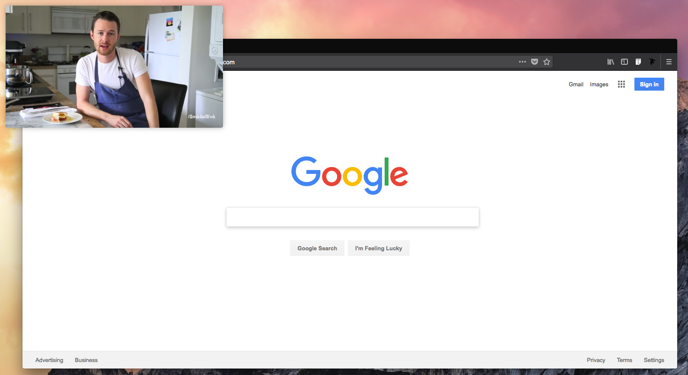
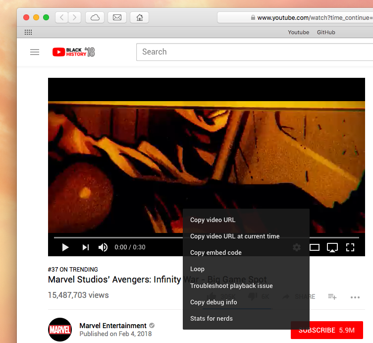
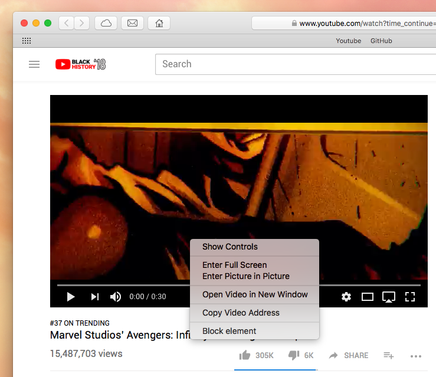

I always love how there are millions of tricks you can do with your macOS to enhance and power up your daily workflow. Recently, I found out that there is a way to pop out a video and display it anywhere on your screen.

### Here's How To Do It

By the way, you must use **Safari**! Other browsers won't work. Safari is a browser in every macOS anywhere, so you should be able to find it very easily.

1. Use Safari to go to Youtube.com and look for a video that you want.
2. Right click on that video to see a bunch of YouTube menus

3. Richt click again to see Safari's menus

4. Click on **Enter Picture-in-Picture**

---

### Side Note

The popped-out video can be repositioned to every corner of your screen. It can be resized too.

In the picture you see above, that's [Byron Talbott](https://www.byrontalbott.com) with his new recipe "The Breakfast Sandwich". Check out his [channel](https://www.youtube.com/channel/UCD5WWnRed32y3xGwmrDhUiQ) if you love home made food.