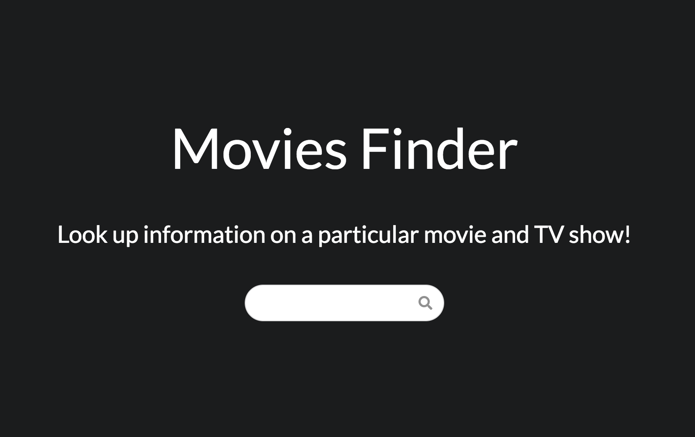
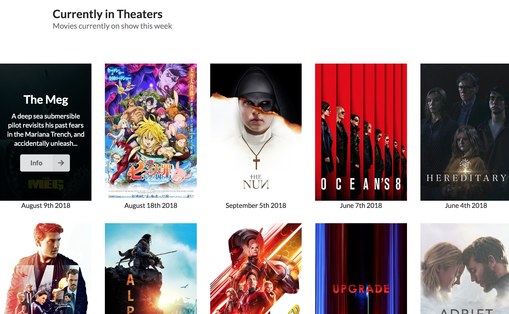
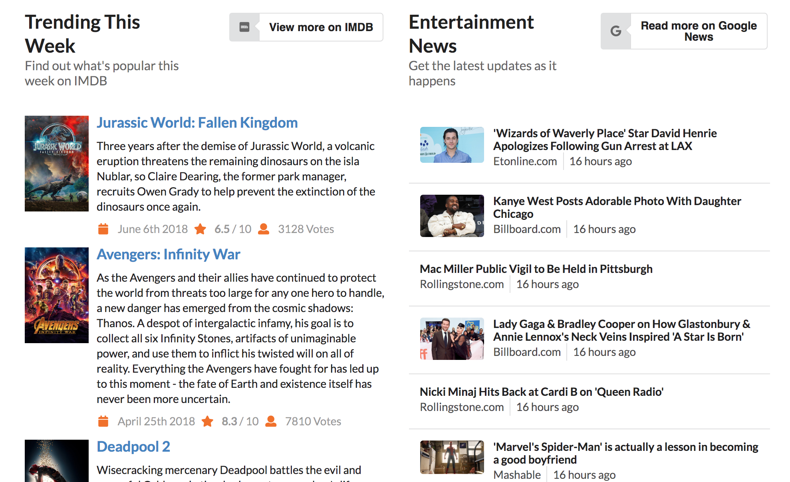
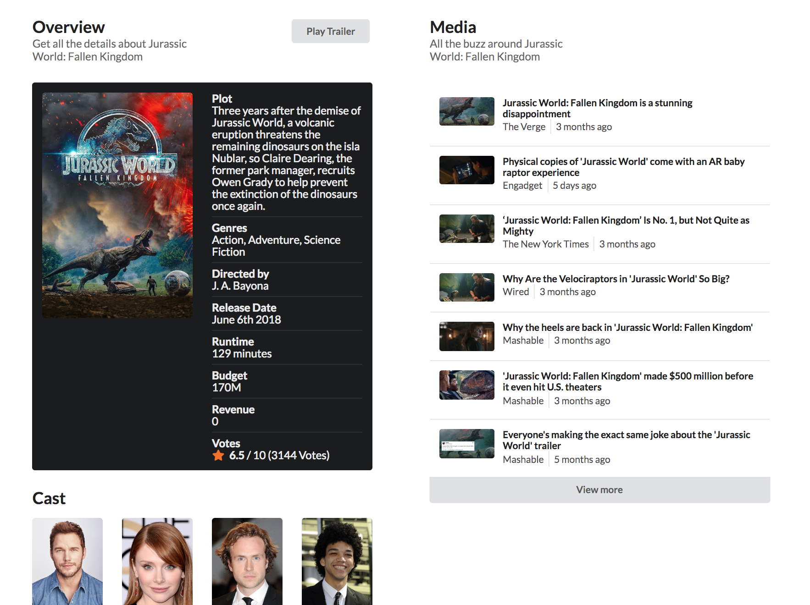

Here’s the link to the live version: [Demo](https://movies-finder-app.herokuapp.com)

### Features

I named the application “Movies Finder”. In general, Movies Finder allows anybody to easily look up information about a particular movie. Say for example, you search for “The Avengers”, the web app will present information such who stars in the film, who’s the director and the rest of the production crew, and news that are relevant to the film.

On the homepage, Movies Finder presents movies that are currently being played in theaters. The app also displays a list of trending movies this week and a list of entertainment news around the world.

### Screenshots





More screenshots at the end.

### API

#### The Movie Database (TMDb)

Movies Finder utilizes several API endpoints provided by this source: [The Movie Database](https://www.themoviedb.org/) (TMDb). The good thing about using this service is that it’s free. You’ll just need to grab an API key to start making requests to the API. With TMDb, I am able to perform search queries against the API for whatever search term the user defines. Their API endpoints are very useful, and the [documentation](https://developers.themoviedb.org/3) itself is extremely well-written.

#### News API

In order to gather news from various sources on the Internet, I decided to go with a service called [News API](https://developers.themoviedb.org/3). The service is free at first, and I believe you’ll eventually have to pay a subscription-based price if the number of API calls exceed a certain limit allowed in the Free Tier.

### Development

#### React vs. Gatsby

I picked out [React](https://github.com/facebook/react) for this project because it’s fast and extremely easy to get started with thanks to the popular [create-react-app] starter kit that is provided by Facebook’s React Team.
I thought about developing this app using my favorite static-site generator called [Gatsby](https://github.com/gatsbyjs/gatsby). But the project that I am working on doesn’t seem to need things like GraphQL, Transformer, Markdown Rendering, and other powerful tools just yet. A simple create-react-app would have been enough in my opinion.

#### User Interface

I didn’t want to completely write my own CSS code to style each individual pages and components. So I selected [Semantic UI React](https://github.com/Semantic-Org/Semantic-UI-React) to work with. Semantic UI React offers an extremely convenience way to quickly add a styled element into a component.

For instance, Movies Finder app heavily uses Semantic UI React’s `<Responsive>`, `<Container>`, `<Button>`, `<Modal>`, `<List>` elements. The `<Responsive>` component/element makes it extremely easy to adjust the size of the parent container with respect to the user’s screen size. The `<Button>` component, for instance, has lots of useful props that I can work with. This makes it so easy to change a button’s icon or placeholder. But perhaps the best component of all is the `<Search>` component. Semantic UI React’s `<Search>` component comes packed with things like event handling and drop-down trigger. That greatly reduces the amount of time I need to write code that will trigger a drop-down feature.

#### Fetching Data

I could not decide at first whether or not to use the latest ES6 promise feature called `async await`. I read this [post] to be more informed.

Eventually I went ahead and used [axios](https://github.com/axios/axios) for this project. This is the first time I have used axios for any of my projects. The syntax is easy to read and there isn’t much to be done in order to fetch and retrieve data (which is great because it saves time).

Here’s how I performed a GET request to one of multiple The Movies Database (TMDb) endpoints. This GET request retrieves movies that are currently in cinemas at the moment.

```kotlin
const { tmdb_api_key, tmdb_default_uri } = Config

// Now Playing
axios.get(`${tmdb_default_uri}/movie/now_playing?api_key=${tmdb_api_key}`)
  .then(res => {
		const currentlyInTheaters = res.data.results
		this.setState({ currentlyInTheaters })
	}
);
```

### Deploying to Heroku

The app is running on Heroku, a cloud platform. Heroku works brilliantly with create-react-app thanks to how they have essentially bootstrapped their CLI to Facebook’s create-react-app starter kit. Here’s the link to the Heroku’s [create-react-app starter kit](https://github.com/mars/create-react-app-buildpack) if you need it.

#### Trending and Entertainment News



#### Movie Details

