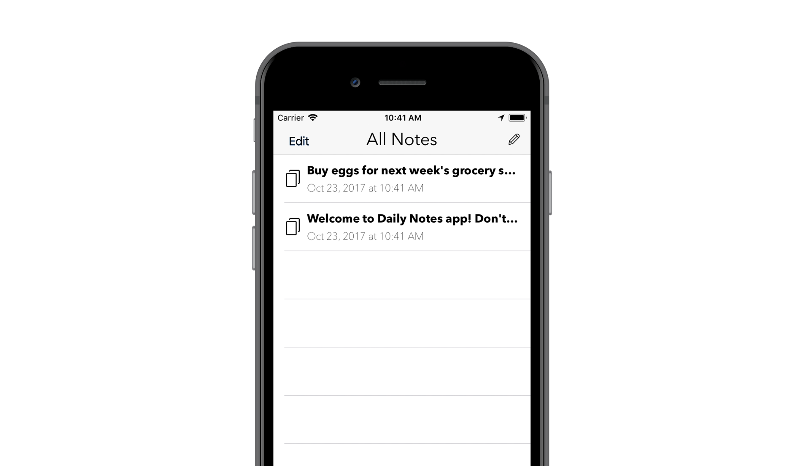

A lightweight mobile application that offers a distraction-free writing interface for note taking. The app displays text in plain text formatting. Back to the basic!

**Download**: Via [App Store](https://itunes.apple.com/us/app/daily-notes-distraction-free/id1299564920).

## Reviews

**Easy and quick to use**. I downloaded a different Note Taking app that was such a pain, I deleted it and went back to Post It’s. Finally decided to try another, and saw this one. I just needed empty space to write a quick note and not have to scramble to find paper and pen, and this works perfectly!!! Write what you want, has edit button, and when finished, just click the check on the top right of the page. Easy!!! Love it… - ***Hula.jenna***

**Fast and simple** It’s actually simple and fast to write notes. 👍 - ***Natnaree J.***

As of February 19th, 2018.

## Resources

**Graphics:** Massive thanks to Gregor Cresnar's [modern icons](https://www.flaticon.com/packs/interface-icon-assets)!