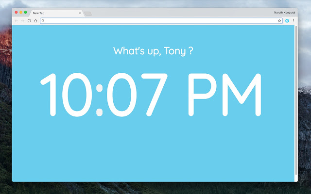
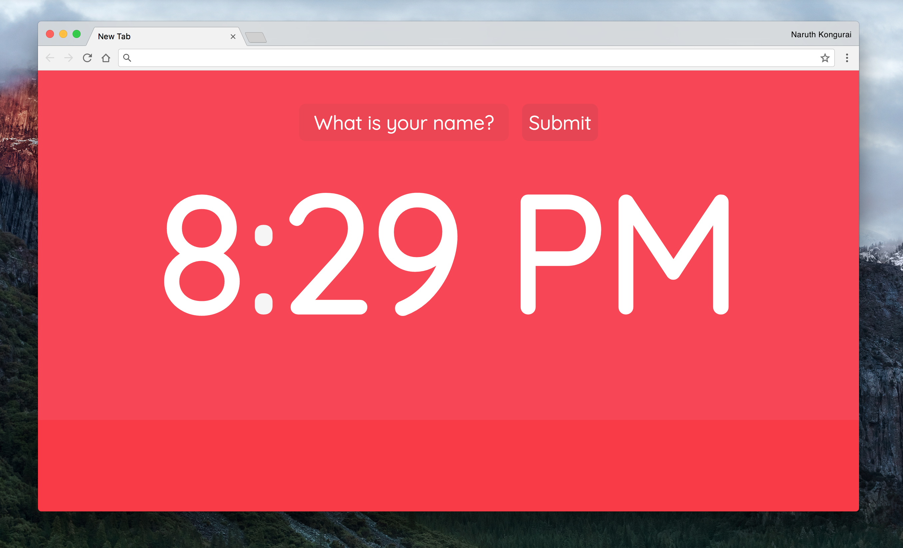

### About the Project

I personally tend to use multiple tabs in Google Chrome. But I felt like the New Tab extension I was using had way too many features (they're great but just too much on the screen). I wanted something light, fresh, and vibrant each time I clicked on the New Tab button.

So I designed my very own new tab page that would display a digital 12-hour format clock.



Click [here to view the extension](https://chrome.google.com/webstore/detail/beautiful-digital-clock-w/jdnjafgehddcpoahelddbflpmoeinaed?hl=en-US&gl=US) in Google Chrome Web Store.

### Features

- Modern and simple in design
- Allows you to provide your name so that it feels more personal
- Tells the time (12-hour format)
- Vibrant background colors

### Thought Process

This was my first project creating a Google Chrome Extension! I used SCSS for modern CSS styling. I also used Pug to create the necessary HTML (just only 10 lines!).

```html
html
  head
    title Beautiful Clock
    link(href="https://fonts.googleapis.com/css?family=Quicksand" rel="stylesheet")

  body
    .display
      .centered
        #hello
        h2#clock
```

The challenge was writing the necessary JavaScript code.

**Here's the breakdown of the core components:**

- Asks the user for a name and caches it to local storage (via `chrome.storage.sync`)
- Finds a random background color
- Displays the clock (converting local time to hours, minutes, seconds, and assigning either "AM" or "PM")

### What I Learned

Creating a basic Google Chrome Extension wasn't as hard as I had imagined. I read three articles to help me get started.

- [Getting Started: Building a Chrome Extension](https://developer.chrome.com/extensions/getstarted)
- [How to Make a Chrome Extension](https://robots.thoughtbot.com/how-to-make-a-chrome-extension)
- [The Beginner's Guide: Build a Simple Chrome Extension in Minutes](https://medium.com/@LindaHaviv/the-beginner-s-guide-build-a-simple-chrome-extension-in-minutes-498308ea406a)

Having launched my first extension, I am now a part of the Google Chrome community of developers, which I am very proud of. 

At the moment of writing, there's 8 people using my extension. Thank you random people!

