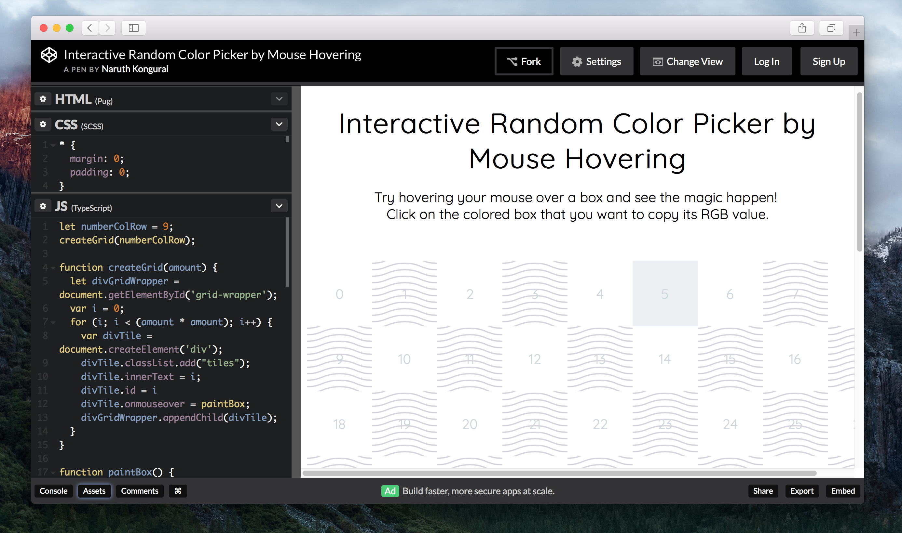

I made an interactive color picker tool that allows you to hover your mouse over a box and see the magic happen!

## CodePen

I recommend that you run this demo on [full screen](https://codepen.io/naruthk/full/LzMwWJ/).

<iframe height='667' scrolling='no' title='Interactive Random Color Picker by Mouse Hovering' src='//codepen.io/naruthk/embed/LzMwWJ/?height=667&theme-id=dark&default-tab=result&embed-version=2' frameborder='no' allowtransparency='true' allowfullscreen='true' style='width: 100%;'>See the Pen <a href='https://codepen.io/naruthk/pen/LzMwWJ/'>Interactive Random Color Picker by Mouse Hovering</a> by Naruth Kongurai (<a href='https://codepen.io/naruthk'>@naruthk</a>) on <a href='https://codepen.io'>CodePen</a>.
</iframe>