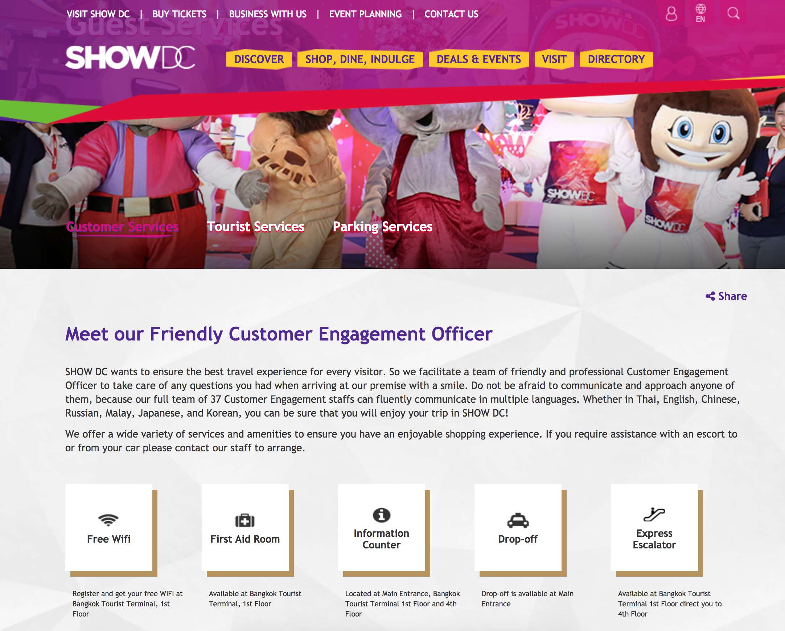

During my internship at **OgilyOne Worldwide** in Bangkok, Thailand, I worked with five other web developers to design a low-fidelity prototype and translate PSD designs into an interactive website for one of Thailand's most popular and newest shopping mall, [**Show DC**](https://www.showdc.co.th/).

## Screenshots

## About Show DC

SHOW DC Corp, is the company owned by AEC Capital Co, Ltd., a private equity property investment fund, which are the joint investment between Thai and Malaysia private investors.

Set to sweep the tourism industry off its feet and revolutionize Bangkok’s tourism landscape, SHOW DC launches an original concept perfectly suited to the needs and desires of Thailand’s modern international visitors as well as the country’s thriving population of 67 million, including a booming middle class. 

No visit to Thailand will be complete without a trip to the iconic SHOW DC. The destination center showcases the best of Thailand and Asia in a contemporary, high-energy environment brought to life by partners from ASEAN and East Asia’s commercial giants, each a leader in their respective industry.