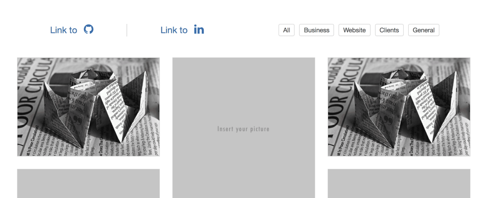

### About the Project

### Features

- One-page template
- Interactive project section

[Live Demo](https://codepen.io/naruthk/full/wrRjKv/)

### Thought Process

The initial idea behind this template was to design a modern, one-page template that any visitor can easily scroll up and down without having to go into multiple pages. I kept the design extremely simple, with the site's logo on the top left corner and the site's slogan at the right hand side. I preferred to have a black background for the header area to gain attention. But I wanted the content to be extremely easy to read, so I opted for a white background over dark text.

Developing the template got me into **Pug** (also known as Jade). Pug is currently one of my favorite web template engines. I used Pug here to reduce the need to write a lot of HTML code. Pug is very strict in terms of indentation but I feel like it makes me more careful (which I think help reduces the tendency for bugs to occur). Aside from using Pug, I also used **SCSS** over CSS because SCSS is more robust, modern, and easy to code with. To process both Pug and CSS, I decided to go for **Gulp** (I didn't know much about Webpack at the time).

I wanted the project section to be interactive. So what I did was incorporating a stack layout. There are multiple catagories at the top right corner. Selecting one will reveal or hide certain project items whether or not they fall into a certain category.

### What I Learned

I realized that in creating a design and website from scratch, a lot more steps and configurations were involved. It's easy to customized a Wordpress site from an existing template that someone else had made. But it is more difficult to setup something from scratch (such as writing your own Gulp file to pipe certain files). I ran into multiple errors (like unable to get Pug and SASS to go together). But it was well worth the effort.

---

### Development

**Building:**

- Do the `git clone` command of this repository
- Move into the directory of this recently cloned repository
- Type and run this command `npm install`
- Run `gulp copy` to output a **dist** folder that contains all the necessary files to properly display the website on the browser
- To enter production mode please run `gulp watch`

**Tools:**

- **SCSS** for styling
- **Pug** for HTML rendering
- **Bootstrap** for layout and components
- **NPM** for package manager
- **Gulp** for automatic build processing
- **FontAwesome** for varied range of icons

**Download:**

- Distributed version: [Download](https://github.com/naruthk/web-theme-portfolio/raw/master/theme.zip)
- Source code: [GitHub](https://github.com/naruthk/web-theme-portfolio)

**Screenshot:**

